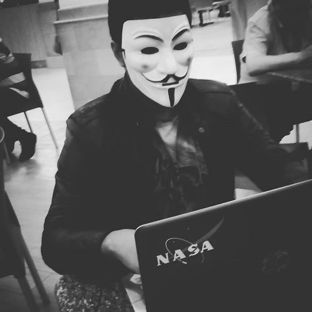

# JhonPaulo.dev

### Hola soy Jhon Merchan pero me puedes decir JP.

me jakiaron

Estudio Ingeniería en Software en la Universidad de Guayaquil, me gusta la tecnología, maker por accidente arregle la tostatora cuando era pequeño y salve el desayuno.

* Activista de hardware y software libre.

* Colaborador de comunidades y eventos tecnológicos.

### Si quieres conocer más sobre la Ingenieria en Software visita mi blog

[Introducción a la Ingenieria en Software](https://jhonpaulo98.github.io/intro_ing_software)

### En redes sociales me puedes encontrar como @jhon_p16

### Visita mi mapa interactivo de eventos

[JP en el mundo](https://gist.github.com/25ecb143aead8a19acdb36469155cd22)

